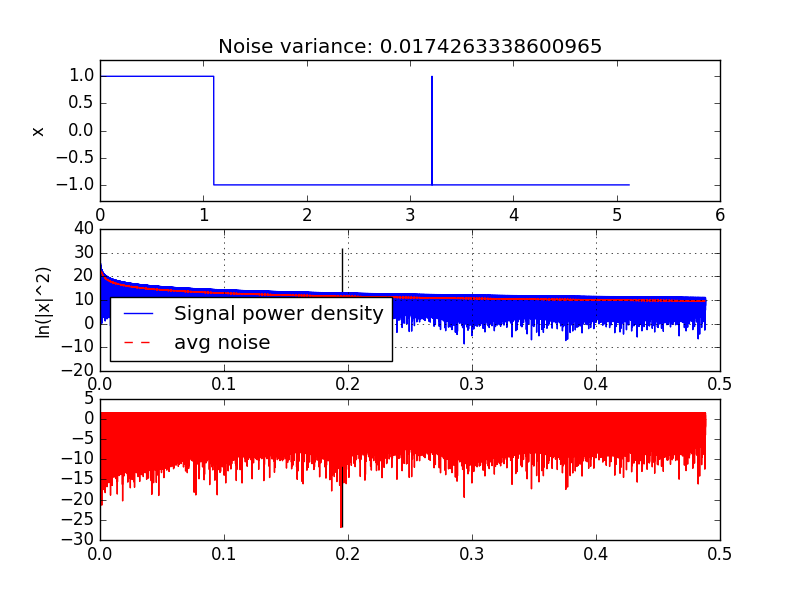
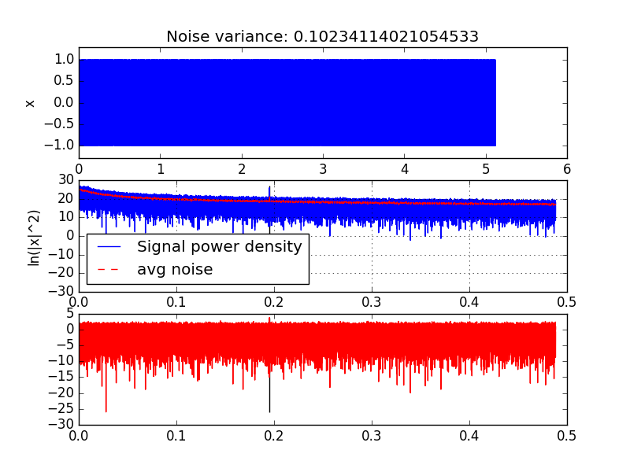
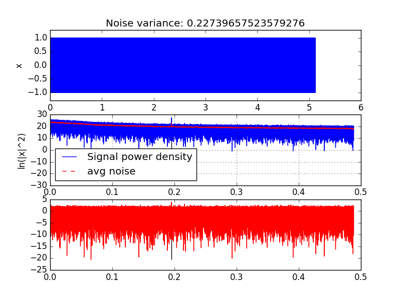
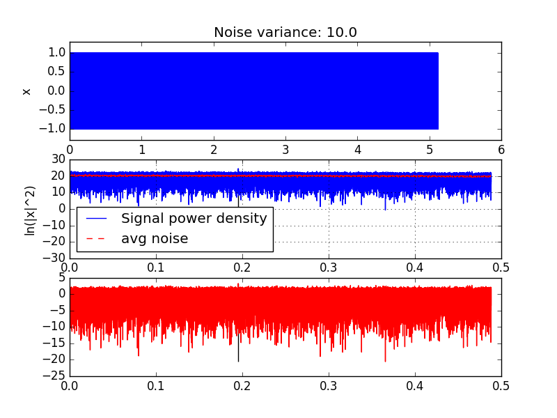
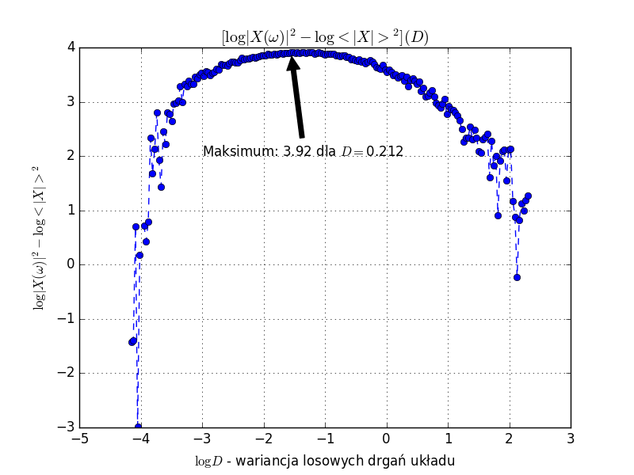

# Laboratorium Specjalistyczne: rezonans stochastyczny
### Mateusz Kaczorek, Dominik Stańczak
## Problem
Rezonans stochastyczny to zjawisko polegające na wzmacnianiu sygnału okresowego poprzez
dodanie do niego składowej stochastycznej. W ćwiczeniu zrealizowaliśmy ten efekt
 poprzez symulację ruchu układu w potencjale bistabilnym z dodaną składową
 czasową, sinusoidalną.
## Symulacja ruchu
Bardzo masywna cząstka porusza się w potencjale:
$$ V(x) = a x^4 - b x^2 - c x\sin(\omega t) $$
Z dodatkiem losowej siły wymuszającej o gaussowskim rozkładzie i wariancji $D$.

Ruch cząstki symulujemy przy użyciu zmodyfikowanego schematu Eulerowskiego ([PRACA, ROK])
przy założeniu, że cząstka jest bardzo masywna [JAK SZŁO TO ZAŁOŻENIE?]
co ostatecznie pozwala nam zapisać schemat aktualizacji pozycji cząstki
między kolejnymi aktualizacjami jako:

$$x_{n+1} = x_n - \nabla V(x_n) dt + \sqrt{2 D dt} \chi$$

gdzie $\chi$ jest zmienną losową z rozkładu normalnego, "normalną"
(o odchyleniu standardowym równym jeden i wartości średniej równej 0).

W tej symulacji całkowaliśmy równania dla następujących parametrów:

| a     | b   |    c | dt     | Liczba kroków w okresie | Liczba okresów na symulację | $\omega = 1/T$ |
|-------|-----|------|--------|-------------------------|-----------------------------|----------------|
| 0.25  | 0.5 | 0.25 |  0.005 | $2^{10}$                | $2^{14}$                    | 0.1953125      |

Poniższe symulacje przeprowadziliśmy dla 200 różnych wartości wariancji liczby losowej $D$ z zakresu od $10^{-2}$ do $10^1$, rozłożonych równomiernie w skali logarytmicznej.
## Analiza fourierowska

W celu analizy trajektorie ruchu w każdej symulacji zamieniliśmy na wartości binarne:
* $1$ gdy $x \geq 0$
* $-1$ gdy $x < 0$

Następnie przeprowadziliśmy analizę fourierowską spektrum mocy danych, używając transformaty Fouriera. Przykłady kilku z tych transformat przedstawiamy na wykresach poniżej.

Transformaty wygładziliśmy, uśredniając 51 najbliższych punktów z kwadratu modułu transformaty Fouriera (widma mocy). Następnie odjęliśmy od widma mocy uśrednioną wartość i dla każdej symulacji odczytaliśmy wartość otrzymanej "względnej" amplitudy dla składowej odpowiadającej okresowej sile wymuszającej.  

## Zebranie danych z 200 symulacji
Wartości składowej odpowiadającej sile wymuszającej zebrane są, w skali log-log, na poniższym wykresie.

## Wnioski
W trakcie realizacji ćwiczenia dowiedzieliśmy się wiele:
* o samym istnieniu zjawiska rezonansu stochastycznego, jego zastosowaniach np. w badaniu zmian klimatycznych oraz [w niestabilnych plazmach](http://scitation.aip.org/content/aip/journal/pop/6/8/10.1063/1.873595)
* jak całkować numerycznie stochastyczne równania różniczkowe, uwzględniając - w pierwszym przybliżeniu - człony proporcjonalne do $\sqrt{dt}$
* jak radzić sobie z długimi szeregami czasowymi (obsługa formatu do zapisu danych liczbowych `.hdf5`)
* jak analizować dane z szeregów czasowych poprzez analizę Fourierowską i jak radzić sobie z szumem w takich symulacjach
