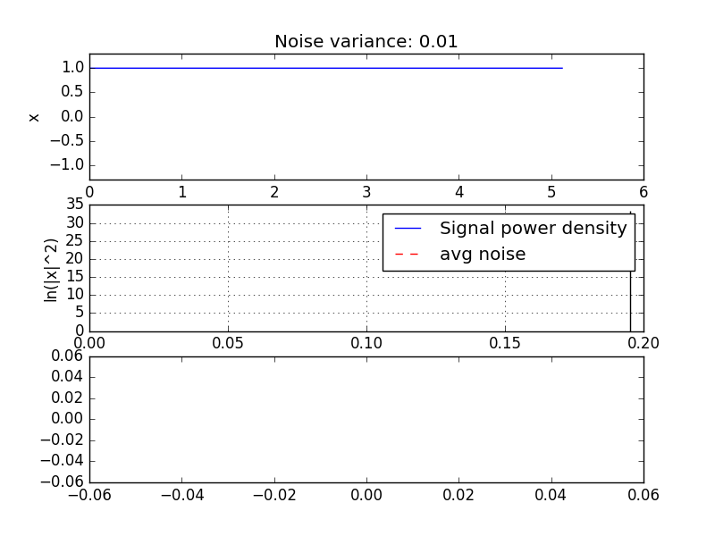

# ProjektKrewetka
Laboratorium Specjalistyczne: rezonans stochastyczny

### Symulacja ruchu
Cząstka rusza się w potencjale:
$$ V(x) = a x^4 - b x^2 + c\sin(\omega t) $$
Z dodatkiem losowej siły wymuszającej o gaussowskim rozkładzie,
### Analiza fourierowska

* 
* 
* 
* 
### Zebranie danych z 200 symulacji

